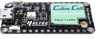

# Heltec CubeCell Board

The Heltec Cubecell HTCC AB0x is Heltec's line of popular ASR605x(ARM® Cortex® M0+ Core) based LoRa development boards with built in USB and battery charging.

## Introduction

Here you will find one or more sample PlatformIO embedded projects designed to transmit LoRaWAN packets using a [Heltec CubeCell Developer Board](https://heltec.org/project/htcc-ab01/).

## Getting Started
For a complete guide to getting started with PlatformIO and the Heltec CubeCell AB0x line of developer boards refer to the Helium documentation set at <https://docs.helium.com/network-iot/devices/development/heltec/cubecell-dev-board>.

## Resources
[Product Page](https://heltec.org/proudct_center/lora/cubecell/)  
[Manual](https://heltec-automation-docs.readthedocs.io/en/latest/cubecell/index.html)  
[US Retailer - Parley Labs](https://shop.parleylabs.com)

## Firmware examples 
* [longfi-helium-us915-basic](examples/cubecell-helium-us915-basic)
* [longfi-helium-us915-gps](examples/cubecell-helium-us915-gps)

### Software

* [VSCode \(IDE)](https://code.visualstudio.com/)
    * [PlatformIO \(VScode Extension)](https://platformio.org/)
* [Helium Console](https://docs.helium.com/console)

