## TODO 
- need a "platformio" id for side bar
- need screen shots

## Heltec CubeCell HTCC PlatformIO Guide

## Introduction to Guide

:::important 

This guide is written targeting the AB02x line of Heltec developer boards. In general the same steps should
apply to other versions of the CubeCell (AB01, CubeCell Capsule) however there may be slight 
differences that are not covered in this guide.

Before we begin, please make sure you've followed the steps from this guide, which goes over some initial setup steps.

:::

## Objective and Requirements

In this guide, you will learn:

* How to setup your PlatformIO IDE environment
* How to program a basic application that will send packets over the Helium Network
* Verify real-time packets sent to the Helium Console via Hotspot that's in range

For this example, you will need one of the following Heltec development boards.
The Helium community has experience with the AB01, AB02x and CubeCell Capsule line
boards. Subsequent follow on products may work but have not been tested

### Hardware

* [Heltec CubeCell Development Boards (AB01, AB02x, Capsule)](https://heltec.org/proudct_center/lora/cubecell/)
* Micro USB Type B Cable - [Example](https://www.amazon.com/AmazonBasics-Male-Micro-Cable-Black/dp/B0719H12WD/ref=sr_1_2_sspa?)

### Software
PlatformIO is not a standalone IDE, it installs as an extension to Microsoft VSCode.
The Helium Console is a cloud based device management tool that we will use to enable our device access to the Helium network.
There is no installation required however one will need to create a user account with the Helium Console.

* [VSCode \(IDE)](https://code.visualstudio.com/)
    * [PlatformIO \(VScode Extension)](https://platformio.org/)
* [Helium Console](https://console.helium.com/) 


## Hardware Setup <a id="hardware-setup"></a>

#### Attaching the LoRa Antenna <a id="adding-the-antenna"></a>

Your board should have come with a U.FL antenna. All you have to do is attach it to the U.FL port on the developer board. Some versions of the boards
may have more than one U.FL port, if this is the case generally the LoRa antenna attaches to the port that 
is on the same side of the board as contains the USB port connector. However, it is best to verify the proper connector with the board
manufacturer.

#### Connect Target Board to Development PC<a id="connect-board"></a>

Next, lets connect our board to our computer with a USB 2.0 A-Male to Micro B cable.


#### Install Develop Machine Serial Driver

Some operating systems, especially Windows, will require the installation of hardware specific USB device driver code.
Installation directions can be found on Heltec's website [here](https://heltec-automation-docs.readthedocs.io/en/latest/general/establish_serial_connection.html).

## Software Setup <a id="software-setup"></a>
Setting up the VSCode/PlatformIO IDE environment while not complex does require several steps that are independent of your target device.
The required procedures are detailed within the following platformio.org document.

[VSCode/PlatformIO Installation](https://docs.platformio.org/en/latest/integration/ide/vscode.html)

Once PlatformIO is installed, you should be welcomed to VSCode with the following "PIO Home" main screen tab: 

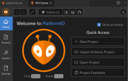

If not already open, the PlatformIO Home view can be opened by clicking on the house icon within the VScode status bar.

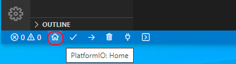

### Creating a New PlatformIO Project
If during the course of installing VSCode and PlatformIO you have not already built, uploaded and verified
the operation of a sample application it is best familiarize yourself with the basic use of PlatformIO before adding
the complexity of Helium network access code to the mix.

If you are familiar and confident with the steps required you can continue at "Updating the sample with Helium network access code"
by clicking [here](#ADD-HELIUM-NETWORK-CODE).
 
The following steps will walk you through the steps required to:
- create a template project
- inspect the default source file, main.cpp as well as the primary project configuration file, platformio.ini
- build the project and inspect the build log output
- upload the sample binary to the target development board.
- inspect serial output debug information.

Before proceeding with actual code that will connect to the Helium network, create a sample, template project.


##### Open "New Project Wizard" - Select project name and board
- Within the Home view click on "New Project".

- At the "Project Wizard" dialog enter a name for your project in the "Name" field.
- Within the "Board" field select the appropriate target board by entering the name of the manufacturer, in this 
case Heltec. The PlatformIO auto search feature should present you with a known
list of Heltec supported boards. For our example we enter "Heltec" and choose
the "Heltec CubceCell-GPS (HTCC-AB02S)" from the supplied list.

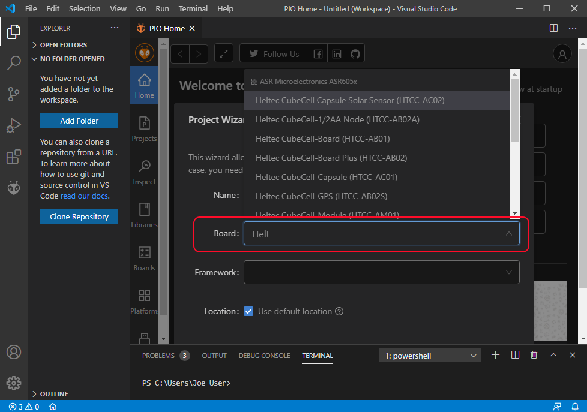

##### Select framework and project location
- Select the desired runtime framework from the "Framework" drop down. At present only "Arduino" is supported for the board we have selected.
- For location, if the checkbox is selected the project will be created within the default PlatformIO workspace, which is sufficient for our purposes.
- Click the "Finish" button to create the project. ( You may need to scroll down the wizard window to expose the Finish button)

Note: The time taken to create a project will vary depending on whether or not the selected platform and framework files have
been previously downloaded.
When the project has been created it should be shown within the PlatformIO Explorer view typically 
found on the left side of the IDE.


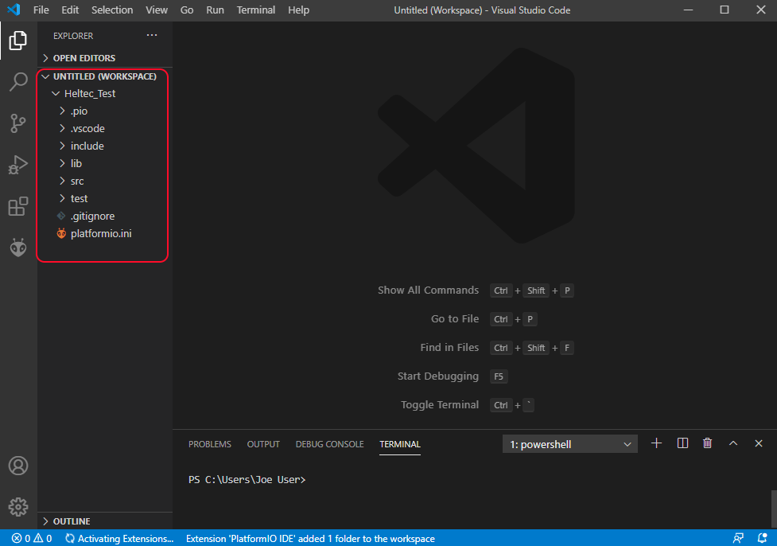
Typical project explorer view.

#### Default project main.cpp
If you are familiar with developing within the Arduino IDE, main.cpp is much the 
same as the Arduino *.ino. It also contains default setup() and loop() functions.

PlatformIO also adds a required "\#include <Arduino.h\>" statement. This is a important/necessary difference between PlatformIO and Arduino IDEs. 

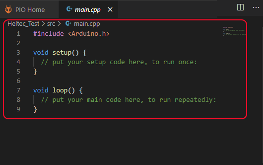

#### platformio.ini - project configurations
Let's take a look at the platformio.ini file in the root of our new project. This is where one defines project configuration definitions.
In the Arduino world one would do this via the IDE tool bar.
Note: when this file is modified the entire project will be rebuilt when the project is next built or uploaded.

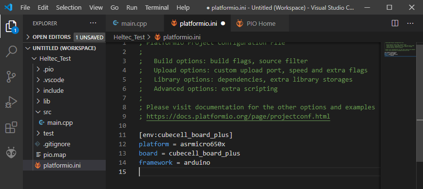

Here we see the platformio.ini file that was created as a result of the running the New Project wizard.


#### Build the target device application

Now that the template project has been created it's time to build the device application. Within PlatformIO the "Build" button is the check-mark found within the bottom status bar. Clicking on this button should start the build process.

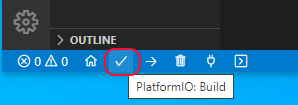


#### Inspect the build output
Due to the defines Within platformio.ini, PlatformIO is able to determine the project board and framework dependencies.
 Any missing dependencies are automatically installed at build time, thus this process may be see in the build output.
  This feature allows us to add libraries into our platformio.ini file, and they will be added in for us at build time.


The build process results can be found within the "Terminal View" typically found at the bottom of the VSCode window.
Much like with Arduino, the build output will dump the calculate amount of Ram and Flash memory 
used by your application. There is also a Problems output view that may help when trying to resolve
build issues.

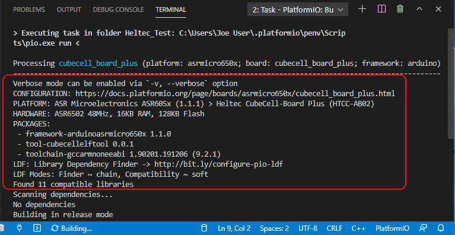

Start of the build output displaying configuration information.

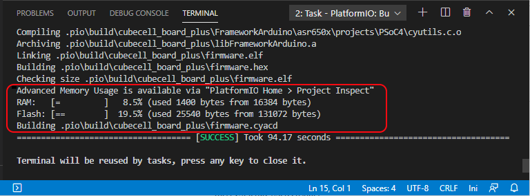
Tail end of build log showing Ram and Flash usage.

#### List of attached devices

If, within the PlatformIO Home view, you select the "Devices" icon on the left,
 you will see listed any attached physical devices as well as their associated comm ports:

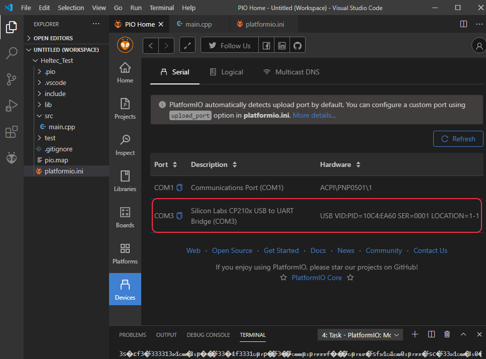

#### Uploading binary to target device
Now that the code has built successfully, if a target device is attached to your computer 
the resulting binary can be uploaded to the target device.

Prior to attempting to upload your binary make sure any terminal session that might be attached 
to the debug comm port has been deleted. Occasionally but not always, PlatformIO will automatically
close the comm port. If it does not upload errors will occur.

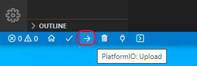

Click on the Upload button within the bottom Status bar.


Below you will see a typical output as the binary is uploaded to the target board.

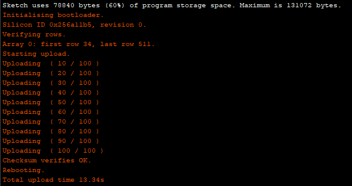

If you have made it this far then we know your environment can build and upload a device application. Now it's time to connect to the Helium network.

### Sample Helium Network Access Code <a name="ADD-HELIUM-NETWORK-CODE"></a>
#### Update main.cpp

Now that we have the required board and library runtime support installed, lets program the board
 with the an example Helium network enabled application.

To update the sample application created above:
- open, within PlatformIO, your projects src/main.ccp file that was created by the wizard.
TODO: get link
- replace the template main.cpp with the application found [here](https://github.com/helium/XXXXXXHeltec-CubeCell-Board/longfi-us915/longfi-us915.ino), copy and paste the entirety of it.

#### Add device credentials

Next we'll need replace the placeholder AppEUI\(msb\), DevEUI\(msb\), and AppKey\(msb\) values found within the sample program with the real values found on the 
 target device page in the Helium Console.
 Be sure to use the formatting buttons to match the endianess and formatting required for the program, shown below.

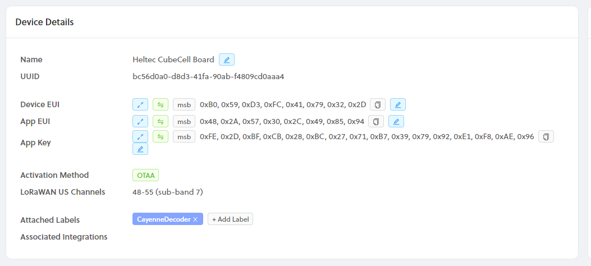

At the top of the main.cpp file, replace the three **FILL\_ME\_IN** fields, with the matching field from the Helium Console, example shown below.
Your numbers will be different depending on what the console creates when you add your target device.

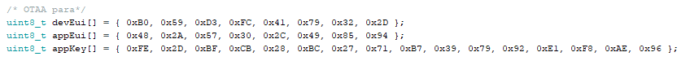

#### platformio.ini - project configurations
For our sample application we need a few configuration items added to the project platformio.ini file.
One set is the project defaults, the next is serial debug monitor configurations and then 
LoRaWAN configurations.

Complete documentation of platformio.ini content can be found [here](https://docs.platformio.org/en/latest/projectconf/index.html).  
Serial debug monitor specific items [here](https://docs.platformio.org/en/latest/projectconf/section_env_monitor.html).

Note: The comment character for this file type is the semicolon.

Update the projects platformio.ini with the following content:
```
; Project Defaults
[env:cubecell_gps]        ; a label for this definitions
platform = asrmicro650x   ; target processor type for CubeCell
board = cubecell_gps      ; denotes this is for board type AB02S
;board = cubecell_board_plus  ; board type for AB02
framework = arduino       ; using ported version of Arduino runtime
; extra custom compile time flags are specified like this
; build_flags =   -I ../lib/cayenne -D LoRaWAN_DEBUG_LEVEL=3 -Wl,-Map=.pio/build/cubecell_gps/output.map
;
;
; Serial debug monitor configurations defines
monitor_speed = 115200       ; debug monitor baud rate, needs to match Serial.begin(xxxx)
; monitor_port = COM[3]
;
;
; LoRaWan configuration defines
board_build.arduino.lorawan.region = US915
board_build.arduino.lorawan.uplinkmode = UNCONFIRMED
board_build.arduino.lorawan.rgb = DEACTIVE
;board_build.arduino.lorawan.debug_level = DIO
board_build.arduino.lorawan.debug_level = FREQ_AND_DIO
;board_build.arduino.lorawan.debug_level = NONE
; NONE, FREQ, FREQ_AND_DIO    
board_build.arduino.lorawan.adr = OFF
board_build.arduino.lorawan.at_support = OFF
board_build.arduino.lorawan.net_reserve = OFF
board_build.arduino.lorawan.class = CLASS_A
board_build.arduino.lorawan.netmode = OTAA
```


Once you have become more familiar with the LoRaWAN/Helium network feel free to experiment with different configuration settings.

#### Build the device application

After updating the main.cpp and platformio.ini files it's time to build the device application. Within
PlatformIO the "Build" button is the check-mark found within the bottom status bar. Clicking on this button should start the build process.

#### Inspect the build results
The build output results can be found within the "Terminal View" typically found at the bottom of the VSCode window.
Verify the build completed successfully.

##### Possible Arduino to PlatformIO porting issues
When porting Arduino sketches to PlatformIO you may find errors such as undefined functions. These may be functions that are called by setup() or loop() or other custom functions
prior to them being defined. This is a side effect of the different C version of C compilers used
with PlatformIO vs Arduino. In this instance we just need to define the function prototype before
the function is actually called. 
Another compatibility issue is that unlike Arduino IDE, you must include Arduino.h
at the start of your C file if you are using Arduino defined constructs.
Generally the compatibility issues are minor. 

#### Verify Heltec runtime configurations.
Running the previous build operation will ensure the Heltec runtime dependencies have been downloaded.
At the time of this writing some versions of Heltec's runtime libraries have set default configuration variables to values that are incompatible
with the Helium network, especially when the Heltec device is configured targeting the North American market. 
Please follow this [link](#HTCC-MANUAL-RUNTIME-UPDATES) and verify the file content. Return here after verification.

If changes needed to be made it is best to run a "Clean" build process by clicking on the Trash Can button on the status bar
followed by a "Build" to ensure the changes have been picked up properly.

#### Upload Binary to target device
If the build process completed successfully, upload the binary to the target device via the "Upload" (right pointing arrow) 
button found on the status bar

NOTE: Prior to attempting to upload your binary make sure any terminal session that might be attached 
to the debug comm port has been deleted. Occasionally but not always, PlatformIO will automatically
close the comm port, if it does not upload errors will occur.


Successful upload example, your results will vary.


#### Viewing Target Device Serial Output <a id="viewing-serial-output"></a>

When your firmware update completes, the board will reset, and begin by joining the network.
 The PlatformIO Serial Monitor can be used to view the serial debug output from the board.
 You will recall that we set the serial port configurations within the platformio.ini file 
 for our project. 

 To open the serial monitor click on the "Serial Monitor" button within the status bar.

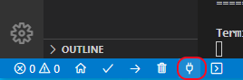

You should begin to see output similar to below.

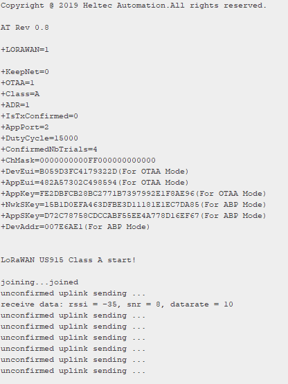

You can use any virtual terminal emulator for this purpose, but recall certain Heltec boards seem
to require the terminal emulator be disconnected from the target device prior to attempting to upload
a new binary.

#### Helium Console Uplinks

Now let's head back to the [Helium Console](https://console.helium.com/) and login to your account.
Once logged in select the "Devices" item on the left, then select the target device previously created.
Scroll down a bit on the device page and you should see something similar to the screenshot below.

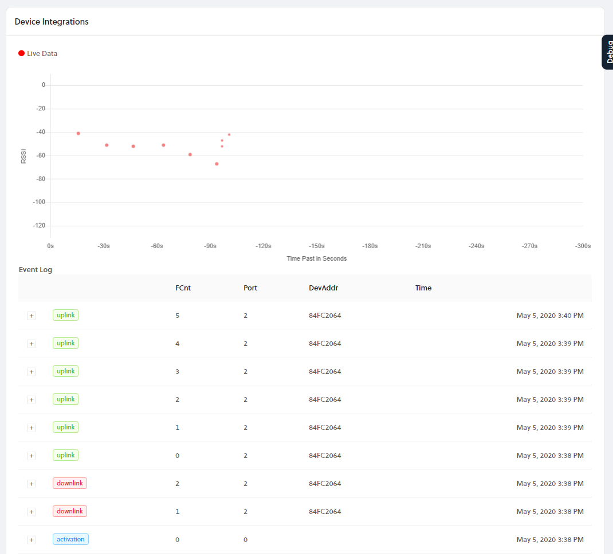

Activation messages are those seen when the device first attempts to join the network.  
Downlink messages are those delivered from the network to your target device.  
Uplink messages are those messages delivered from your target device to the Helium network.

Congratulations! You have just transmitted data on the Helium network! The next step is to learn how to use your device data to build applications, visit our Integrations docs here.

### Misc device application hints
Follow this [link](#HTCC-APPLICATION-HINTS) for useful application enhancements.

### Manual updates to the Heltec runtime libraries <a name="HTCC-MANUAL-RUNTIME-UPDATES"></a>
Some versions of Heltec's runtime libraries have set default configuration variables to values that are incompatible with the Helium network, especially when the Heltec device is configured targeting the North American market. 
The following discusses Heltec runtime files that must be inspected to ensure compatibility. The exact location of these files will depend on which operating system you are using, Windows, Linux, or Mac.
The typical top level locations of the runtime libraries is shown below for each operating system. From there the following discussions will present to you the file locations within these top level directories/folders. Please note the Heltec library version numbers are expected to change as time goes on.
XXXXX denotes your specific user id.

##### PlatformIO IDE Heltec runtime library locations:

* Windows
```text
C:\Users\XXXX\.platformio\packages\framework-arduinoasrmicro650x\
```
* Linux
```text
/home/XXXXX/.platformio/packages/framework-arduinoasrmicro650x/
```
* Mac
```text
/Users/XXXXX/.platformio/packages/framework-arduinoasrmicro650x/
```

#### Verify LoRaWAN Data Rate
Within an editor of your choice open the file path formed by prepending the above described IDE/platform specific top level directory structure to the following file:
```text
libraries/LoRa/src/LoRaWan_APP.cpp    (LiHTCC-APPLICATION-HINTS
NOTE: If you try to transfer a packet that is larger than this setting allows, your device may successfully join the network but the data transmit will fail silently.

Update the LORAWAN\_DEFAULT\_DATARATE as appropriate for your application needs.
The above values are valid for the US902-928MHz region\(North America\), the values may differ for other LoRa regions, which you can find [here](https://lora-alliance.org/resource-hub/rp2-101-lorawanr-regional-parameters).

#### Verify LoRaWAN preamble size
There are some versions of the Heltec runtime libraries that may set a LoRaWAN preamble size that is incompatible with the current LoRaWan specification. If the preamble size is not set correctly your device cannot join the network.
This should be verified in the region specific file corresponding to the region your device is targeting. 
Be sure to prepend the above described platform/IDE specific top level directory structure.

The following is the file that must be checked if targeting region US915.
Within an editor of your choice open the file path formed by prepending the above described IDE/platform specific top level directory structure to the following file:

```text
cores/asr650x/loramac/mac/region/RegionUS915.c     (Linux/Mac)
cores\asr650x\loramac\mac\region\RegionUS915.c     (Windows)
```

Within this file locate the line below, the 7th parameter which might be 14 should be changed to either 8 or 16. Either value will work. Earlier versions of the runtime may have this value set to 14 which is "not" correct.
Change:
```text
Radio.SetTxConfig( MODsEM_LORA, phyTxPower, 0, bandwidth, phyDr, 1, 14, false, true, 0, 0, false, 3e3 );
```
To:
```text
Radio.SetTxConfig( MODEM_LORA, phyTxPower, 0, bandwidth, phyDr, 1, 8, false, true, 0, 0, false, 3e3 );
```

Heltec support has been notified of these issues, hopefully a future release of those libs will resolve the issues.


### Patching ADR Functionality

The CubeCell may have issues joining the network with ADR OFF. If you're using ADR ON, you may also encounter an issue where your CubeCell stops successfully sending packets after a few minutes. This is caused by the CubeCell firmware's ADR behavior, and may happen if your payload is above the DR0 maximum size \(11 bytes\).

To patch the CubeCell firmware, find and open the `RegionUS915.c` file in the firmware directory. On macOS, an example path would be `~/Library/Arduino15/packages/CubeCell/hardware/CubeCell/1.0.0/cores/asr650x/loramac/mac/region/RegionUS915.c`.

Find the following lines in the file and comment them out:

```text
// Decrease the datarate
getPhy.Attribute = PHY_NEXT_LOWER_TX_DR;
getPhy.Datarate = datarate;
getPhy.UplinkDwellTime = adrNext->UplinkDwellTime;
phyParam = RegionUS915GetPhyParam(&getPhy);
datarate = phyParam.Value;
```

This will prevent the CubeCell from reducing the Data Rate over time and allow you to send larger packets on a repeated, prolonged basis.

### Device application hints<a id="HTCC-APPLICATION-HINTS"></a>

#### Using HTCC-AB02S Board With GPS Capable Sketch <a id="HTCC-AB02S-with-GPS"></a>

If you are using the HTCC-AB02S board with a program that is GPS enabled but find the device is unable to obtain a GPS lock you can try changing the GPS data satellite source via the GPS class Air530.setMode\(\) API. Add the Air530.setmode\(\) to the setup\(\) method of your sketch.

```text
// MODE_GPS - US,
// MODE_GPS_BEIDOU - Chinese - This is the default
// MODE_GPS_GLONASS - Russian
// set what works best for your connectivity, for example: 
Air530.setmode(MODE_GPS);
```

#### Dynamically altering Data Rate
A recent change to the Heltec runtime exposes an API interface a device application can
use to alter the current LoRaWAN data rate.
```text
LoRaWAN.setDataRateForNoADR(int8_t dataRate);
```
This should be done sometime after LoRaWAN.init() is called.