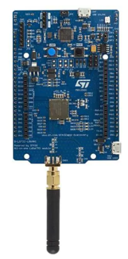

# STM32L0 Discovery kit LoRa Wireless (ST-BL072Z-LRWAN1)

The ST-BL072Z-LRWAN developer board is one of ST's long line of popular developer boards. This board is one of their LoRa connectivity offerings.

## Introduction

Here you will find one or more sample PlatformIO embedded projects designed to transmit LoRaWAN packets using an [ST-BL072Z-LRWAN1](https://www.st.com/en/evaluation-tools/b-l072z-lrwan1.html).

For a complete guide to getting started with PlatformIO and the CubeCell refer to the [Getting started with Helium and PlatformIO](../getting-started.md).

## Resources
[Product Page](https://www.st.com/en/evaluation-tools/b-l072z-lrwan1.html)  
[Manual](https://www.st.com/en/evaluation-tools/b-l072z-lrwan1.html#documentation)  

## Firmware examples 
* [longfi-us915-double-tap](examples/arduino-helium-us915-double-tap/)
* [longfi-us915-pedometer](examples/arduino-helium-us915-pedometer/)

### Software
The following products are required. Refer to the [Getting started with Helium and PlatformIO](../getting-started.md) guide for details.

* [VSCode \(IDE)](https://code.visualstudio.com/)
    * [PlatformIO \(VScode Extension)](https://platformio.org/)
* [Helium Console](https://www.helium.com/console) 

 ## Special Instructions
 ### Creating a PlatformIO project
 When creating a project within PlatformIO select:
 * for board select "ST DISCO-L072CZ-LRWAN1"
 * for framework select "Arduino"
